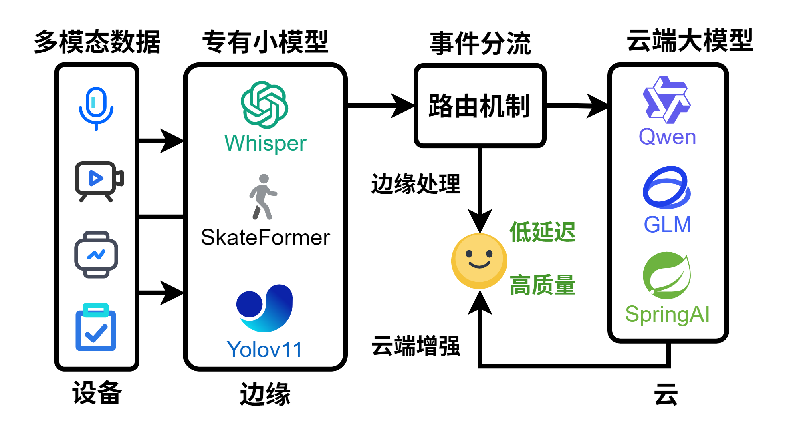
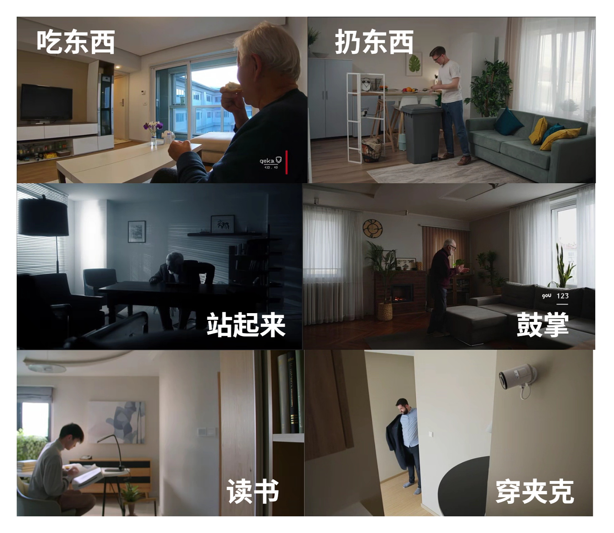
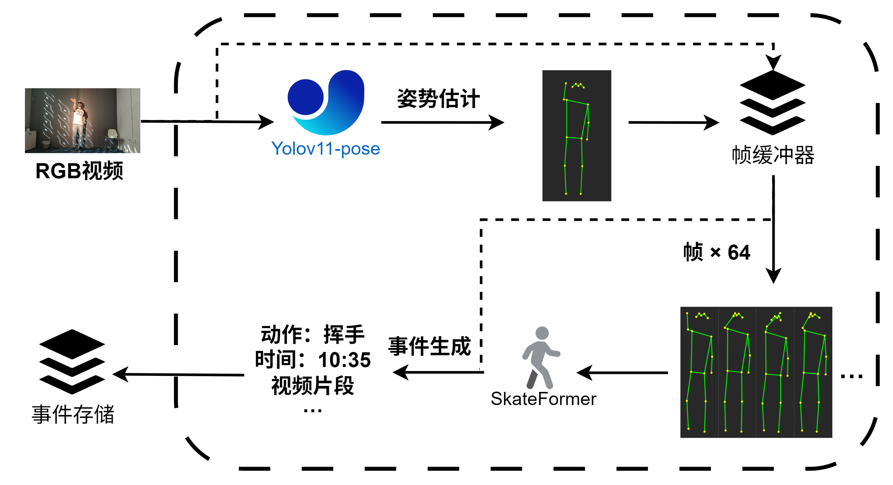
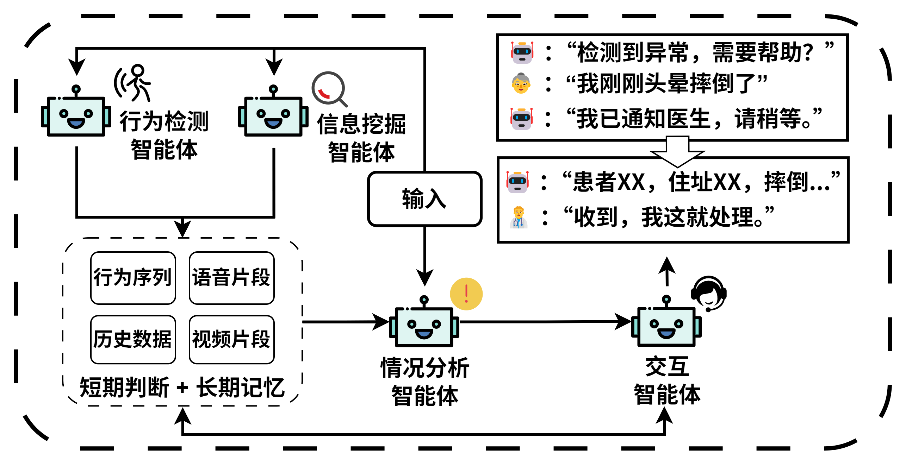

# 灵犀守护：基于云边协同与多智能体的主动式养老守护系统


[](#)

“灵犀守护”是一个专为居家养老场景设计的主动式、智能化守护系统。它不仅仅是一个被动的警报器，而是一位全天候、高智能的“隐形守护者”。

我们正处在一个不可逆转的全球性人口结构变迁时代，中国正以前所未有的速度步入深度老龄化社会。传统的养老模式面临巨大挑战，而“灵犀守护”旨在通过前沿的人工智能技术，为亿万老年人构筑一个更安全、更健康、更有尊严的晚年生活。

我们创新性地提出了**“云边协同，大小模型共舞”**的核心架构，充分利用边缘计算的低延迟、高隐私性，以及云端计算的强大智能与广阔知识，构建了一个优势互补、高效协同的系统。

### 核心架构一览

系统通过在边缘端（如家中部署的NVIDIA Jetson设备）运行轻量级的**YOLOv11**和**SkateFormer**模型，实现对摔倒、长时间静止等关键事件的实时、高精度捕捉。一旦检测到异常，结构化的“事件流”将被安全地推送到云端，由云端的大语言模型（如**Qwen, GLM-4V**）和多智能体系统进行深度分析、情境理解和智能决策。

<p align="center">
  
</p>
<p align="center">
  <em>图1：灵犀守护的云边协同与多智能体架构</em>
</p>

---

## ✨ 核心特性

- **🚀 云边协同智能架构**: 边缘端负责实时感知与初步判断，云端负责深度分析与智能决策，兼顾了响应速度、数据隐私和智能水平。
- **🤖 多智能体协作系统**: 将系统能力拟人化为“行为检测”、“信息挖掘”、“情境分析”、“智能交互”等多个智能体，协同工作，实现从被动响应到主动守护的转变。
- **🚨 主动式安全预警**: 能够7x24小时不间断监测，精准识别摔倒、长时间静止、剧烈咳嗽等多种异常事件，并通过主动语音对话确认情况，有效过滤误报。
- **🧠 多模态融合感知**: 不仅依赖视觉信息，还可集成Whisper等模型处理音频信号（如呼救声），未来可扩展至毫米波雷达等更多传感器，构建全方位的感知网络。
- **🎥 关键事件录制与追溯**: 自动录制异常事件发生前后的视频片段，并经脱敏处理后推送给家属，为事后了解情况和远程关怀提供关键信息。
- **💬 LLM赋能的拟人化交互**: 云端大模型不仅能复核事件，更能以富有同理心的语言与老人、家属甚至医护人员进行多轮对话，提供情感支持和有效信息。
- **🖼️ AIGC数据增强**: 针对养老场景中标注数据稀缺的难题，我们利用AIGC技术（如通义万相）生成大量高度相关的合成数据，显著提升了边缘端模型的鲁棒性和泛化能力。

<p align="center">
  
</p>
<p align="center">
  <em>图2：利用AIGC生成多样化的训练数据</em>
</p>

---

## 🔧 系统工作流

“灵犀守护”的智能始于边缘，成于云端，最终回归于对人的关怀。

1.  **边缘实时处理**: 摄像头捕捉的视频流在本地设备上被实时处理。`YOLOv11-pose`模型提取人体骨骼关键点，形成时序数据。
2.  **动作序列识别**: `SkateFormer`模型分析骨骼序列，识别出如“挥手”、“起身”、“摔倒”等具体动作。
3.  **事件上报云端**: 当检测到预设的关键事件（如“摔倒”）时，边缘端将结构化的事件信息（时间、类型、置信度）和相关数据片段（视频、音频）加密上传至云端。

<p align="center">
  
</p>
<p align="center">
  <em>图3：边缘端实时行为识别流水线</em>
</p>

4.  **云端智能决策**: 云端的多智能体系统被激活。
    - **情况分析智能体** 结合历史数据和当前事件，评估紧急程度。
    - **交互智能体** (基于LLM) 发起主动语音对话（“爷爷，您还好吗？检测到您可能摔倒了”）。
    - 根据老人的回应，系统决定是解除警报、通知家人，还是直接联系紧急服务。

<p align="center">
  
</p>
<p align="center">
  <em>图4：云端多智能体协作与决策流程</em>
</p>

---

## 🛠️ 安装与部署

### 1. 环境准备

- **硬件**:
  - **云端**: 任何支持PyTorch和CUDA的服务器。
  - **边缘端 (推荐)**: NVIDIA Jetson系列开发板 或 任何带NVIDIA GPU的PC。
- **软件**:
  - Python 3.8+
  - FFmpeg (用于视频处理)
  - CUDA 11.x 或更高版本

### 2. 安装步骤

```bash
# 1. 克隆本仓库
git clone <your-repository-url>
cd LingxiGuardian

# 2. 创建并激活Python虚拟环境 (推荐)
python3 -m venv venv
source venv/bin/activate  # On Windows, use `venv\Scripts\activate`

# 3. 安装核心依赖
pip install -r requirements.txt

# 4. (可选) 安装LLM和云存储依赖
# 如果您需要使用智谱AI、阿里云OSS等服务
pip install zhipuai>=2.0.0 oss2>=2.15.0
```

### 3. 模型准备

请从官方渠道下载所需的模型权重文件，并放置在项目指定的目录中（通常是 `models/` 或在配置文件中指定路径）。
- **YOLO Pose**: 例如 `yolov8l-pose.pt`
- **SkateFormer**: 预训练的 `skateformer.pth` 权重

---

## 🚀 快速开始

### 1. 配置系统

编辑 `configs/stream_config.yaml` 文件，设置您的模型路径、视频源、目标动作等参数。

```yaml
stream_config:
  yolo_model_path: "models/yolov8l-pose.pt"
  skateformer_config_path: "configs/skateformer_config.yaml"
  skateformer_weights_path: "models/skateformer.pth"
  
  # 关注的动作及其优先级 (ID请参考数据集定义, e.g., 42: falling)
  target_actions:
    enabled: true
    boost_factor: 3.0
    actions:
      - {id: 42, name: "摔倒", priority: "critical"}
      - {id: 8, name: "长时间静止", priority: "high"}
  
  # 事件录制配置
  video_recording:
    enabled: true
    output_dir: "event_clips"
    pre_event_seconds: 5.0
    post_event_seconds: 5.0

  # LLM API配置
  llm_inference:
    provider: "zhipuai" # 或 "local", "openai"
    api_key: "YOUR_ZHIPU_API_KEY"
    # ...
```

### 2. 启动服务

#### 作为Python模块调用

```python
from action_recognition_stream import ActionRecognitionStream, ActionEvent

# 定义事件回调函数，当检测到事件时触发
def on_action_event_detected(event: ActionEvent):
    print(f"🚨 事件警报! 动作: {event.action_name}, "
          f"置信度: {event.confidence:.2f}, 时间: {event.timestamp:.1f}s")
    if event.video_path:
        print(f"  -> 事件录像已保存至: {event.video_path}")

# 初始化并启动识别流
stream_processor = ActionRecognitionStream(
    config_path="configs/stream_config.yaml",
    event_callback=on_action_event_detected
)

# 从不同来源启动
stream_processor.start_stream("path/to/demo_video.mp4")  # 视频文件
# stream_processor.start_stream(0)                         # 摄像头
# stream_processor.start_stream("rtsp://your_stream_url")  # RTSP流
```

#### 使用命令行启动

```bash
# 使用配置文件运行
python main.py --input-video path/to/demo_video.mp4 --config configs/stream_config.yaml

# 命令行覆盖部分配置
python main.py --input-video 0 \
    --config configs/stream_config.yaml \
    --boost-factor 4.0 \
    --target-actions 42 8
```

---

## 📄 许可

本项目本身采用 `[Your License]` 许可。
项目中使用的第三方模型遵循其原始许可：
- [YOLOv8](https://github.com/ultralytics/ultralytics): AGPL-3.0 License
- [SkateFormer](https://github.com/SAKOFEDRA/SkateFormer): 请查阅其原始仓库的许可协议。

使用本项目时，请务必遵守所有相关许可协议。
